








#  About Me

Hi there! My name is Run He(Chinese: 何润), and I'm currently a second year master student at the [Shien-Ming Wu School of Intelligent Engineering (WUSIE)](https://www2.scut.edu.cn/wusie/), [South China University of Technology (SCUT)](https://www.scut.edu.cn/new/). I am currently advised by Assoc. Prof. [Huiping Zhuang](zhuanghp.github.io). Before my matser, I obtained my bachelor's degree at the same school of WUSIE, SCUT in June, 2023.

My research includes **Continual Learning**, **Federated Learning**, and **Large Language Models**. My current reserach mainly focus on the continual learning of (Multi-modal) large language models.

I am anticipated to graduate in June, 2026 and **I am currently looking for a Ph.D. position in 2026Fall**. Please feel free to  contact me via email or **Wechat: H-359754814**, if you are interested in collaborating with me or recruiting me 😊. Here is my [CV](https://rhe502.github.io/RunHe_CV.pdf).

#  Latest News

<ul>
  <li><em>2025.05:</em> Two papers about continual learning are accpeted by <strong>ICML 2025</strong>!</li>
  <li><em>2025.02:</em> One paper focusing on federated learning is accepeted by  <strong>CVPR 2025</strong>. </li>
  <li><em>2024.09:</em> Two papers about continual learning are accpeted by <strong>NeurIPS 2024</strong>.</li>
</ul>

#  Publications

&dagger;: equal contribution

\* : corresponding author

## Conference Papers

<dl>
  <dt>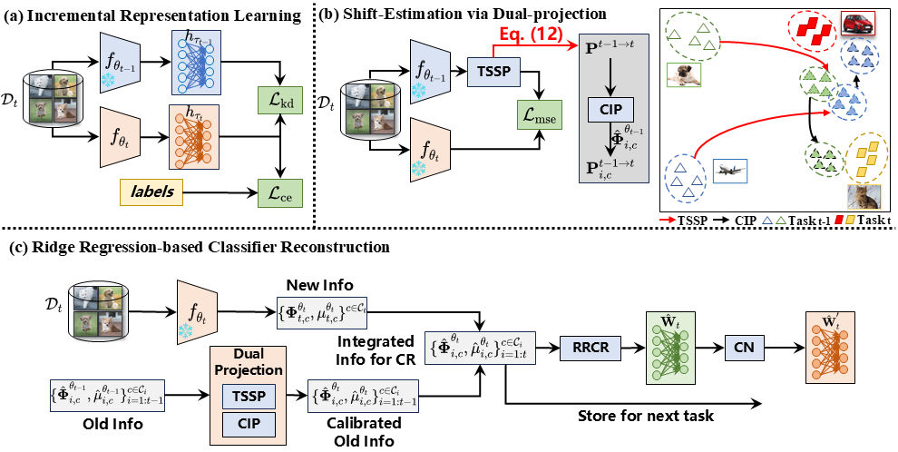</dt>
  <dd><a href="https://arxiv.org/abs/2503.05423" class="publication-title">Semantic Shift Estimation via Dual-Projection and Classifier Reconstruction for Exemplar-Free Class-Incremental Learning</a></dd>
  <dd><strong>Run He</strong>, Di Fang, Yicheng Xu, Yawen Cui, Ming Li, Cen Chen, Ziqian Zeng, Huiping Zhuang*</dd>
  <dd>International Conference on Machine Learning <strong>(ICML)</strong>, 2025 (accpeted)</dd>
  <dd><a href="https://arxiv.org/abs/2503.05423">[ArXiv]</a> <a href="https://github.com/RHe502/ICML25-DPCR">[Codes]</a></dd>
</dl>

<dl>
  <dt>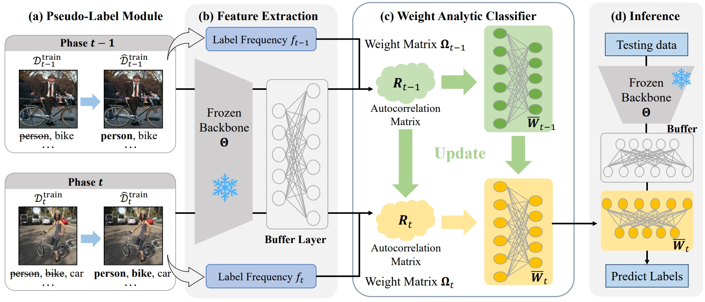</dt>
  <dd><a href="https://arxiv.org/abs/2506.00816" class="publication-title">L3A: Label-Augmented Analytic Adaptation for Multi-Label Class Incremental Learning</a></dd>
  <dd>Xiang Zhang, <strong>Run He</strong>, Chen Jiao, Di Fang, Ming Li, Ziqian Zeng, Cen Chen, Huiping Zhuang*</dd>
  <dd>International Conference on Machine Learning <strong>(ICML)</strong>, 2025 (accpeted)</dd>
  <dd><a href="https://arxiv.org/abs/2506.00816">[ArXiv]</a> <a href="hhttps://github.com/scut-zx/L3A">[Codes]</a></a> </dd>

<dl>
  <dt>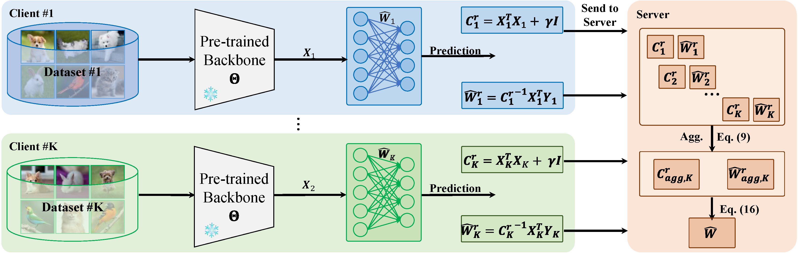</dt>
  <dd><a href="https://openaccess.thecvf.com/content/CVPR2025/html/He_AFL_A_Single-Round_Analytic_Approach_for_Federated_Learning_with_Pre-trained_CVPR_2025_paper.html" class="publication-title">AFL: A Single-Round Analytic Approach for Federated Learning with Pre-trained Models</a></dd>
  <dd> <strong>Run He</strong>, Kai Tong, Di Fang, Han Sun, Ziqian Zeng, Haoran Li, Tianyi Chen, Huiping Zhuang*</dd>
  <dd>Proceedings of the Computer Vision and Pattern Recognition Conference <strong>(CVPR)</strong>, 2025</dd>
  <dd><a href="https://openaccess.thecvf.com/content/CVPR2025/html/He_AFL_A_Single-Round_Analytic_Approach_for_Federated_Learning_with_Pre-trained_CVPR_2025_paper.html">[Paper]</a> <a href="https://github.com/ZHUANGHP/
Analytic-federated-learning">[Codes]</a> <a href="https://arxiv.org/abs/2405.16240">[ArXiv]</a></dd>
</dl>

<dl>
  <dt>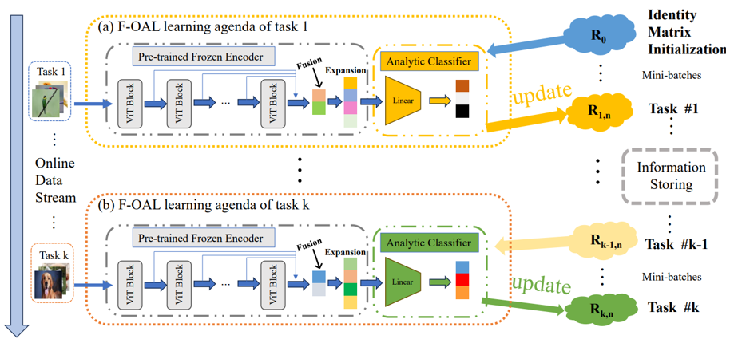</dt>
  <dd><a href="https://proceedings.neurips.cc/paper_files/paper/2024/hash/48ffa38c13078d6ce26b328e7f373243-Abstract-Conference.html" class="publication-title">F-OAL: Forward-only Online Analytic Learning with Fast Training and Low Memory Footprint in Class Incremental Learning</a></dd>
  <dd>Huiping Zhuang&dagger;, Yuchen Liu&dagger;, <strong>Run He</strong>, Kai Tong, Ziqian Zeng, Cen Chen*, Yi Wang, Lap-Pui Chau</dd>
  <dd>Advances in Neural Information Processing Systems <strong>(NeurIPS)</strong>, 2024</dd>
  <dd><a href="https://proceedings.neurips.cc/paper_files/paper/2024/hash/48ffa38c13078d6ce26b328e7f373243-Abstract-Conference.html">[Paper]</a> <a href="https://github.com/liuyuchen-cz/F-OAL">[Codes]</a></dd>
</dl>

<dl>
  <dt>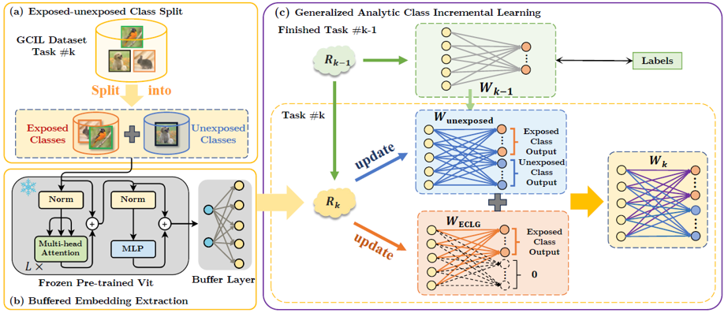</dt>
  <dd><a href="https://proceedings.neurips.cc/paper_files/paper/2024/hash/9713d53ee4f31781304b1ca43266f8d1-Abstract-Conference.html" class="publication-title">GACL: Exemplar-Free Generalized Analytic Continual Learning</a></dd>
  <dd>Huiping Zhuang&dagger;, Yizhu Chen&dagger;, Di Fang, <strong>Run He</strong>, Kai Tong, Hongxin Wei, Ziqian Zeng*, Cen Chen*</dd>
  <dd>Advances in Neural Information Processing Systems <strong>(NeurIPS)</strong>, 2024</dd>
  <dd><a href="https://proceedings.neurips.cc/paper_files/paper/2024/hash/9713d53ee4f31781304b1ca43266f8d1-Abstract-Conference.html">[Paper]</a> <a href="https://github.com/CHEN-YIZHU/GACL">[Codes]</a></dd>
</dl>

<dl>
  <dt>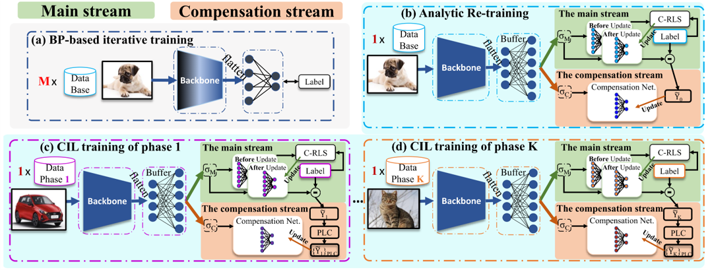</dt>
  <dd><a href="https://ojs.aaai.org/index.php/AAAI/article/view/29670" class="publication-title">DS-AL: A Dual-Stream Analytic Learning for Exemplar-Free Class-Incremental Learning</a></dd>
  <dd>Huiping Zhuang, <strong>Run He</strong>, Kai Tong, Ziqian Zeng, Cen Chen*, Zhiping Lin</dd>
  <dd>Proceedings of the AAAI Conference on Artificial Intelligence <strong>(AAAI)</strong>, 2024</dd>
  <dd><a href="https://ojs.aaai.org/index.php/AAAI/article/view/29670">[Paper]</a> <a href="https://github.com/ZHUANGHP/Analytic-continual-learning">[Codes]</a></dd>
</dl>

<dl>
  <dt>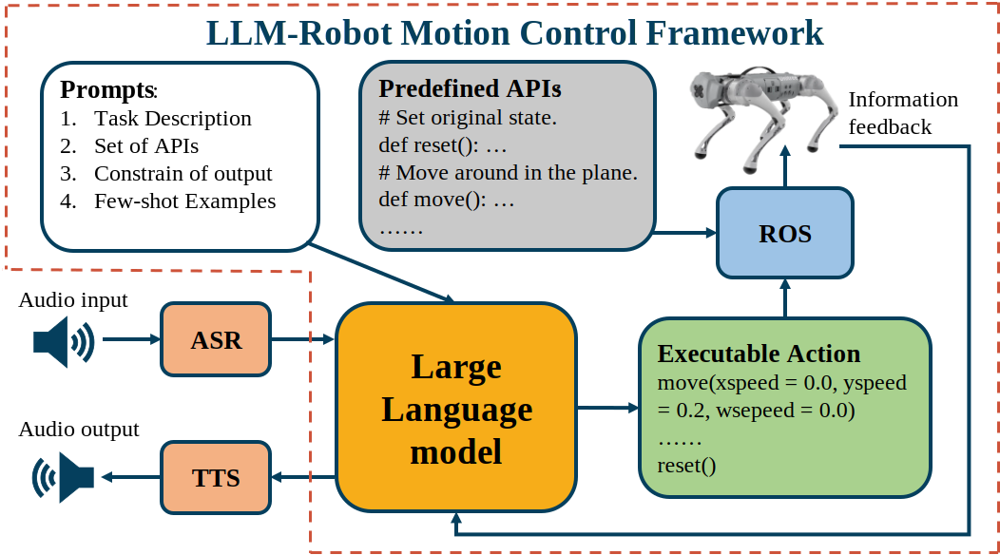</dt>
  <dd><a href="https://ieeexplore.ieee.org/abstract/document/10558349/authors#authors" class="publication-title">Complex Motion Planning for Quadruped Robots Using Large Language Models</a></dd>
  <dd> Xiang Zhang, <strong>Run He</strong>,  Kai Tong, Shuquan Man, Jingyu Tong, Haodong Li, Huiping Zhuang*</dd>
  <dd>IEEE International Symposium on Circuits and Systems <strong>(ISCAS)</strong>, 2024</dd>
  <dd><a href="https://ieeexplore.ieee.org/abstract/document/10558349/authors#authors">[Paper]</a>  </dd>
</dl>

<dl>
  <dt>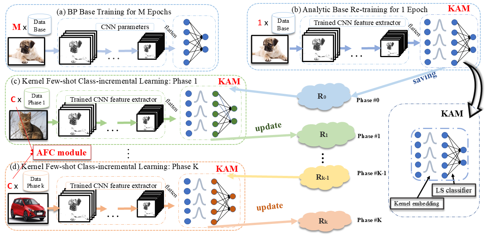</dt>
  <dd><a href="https://openaccess.thecvf.com/content/CVPR2025/html/He_AFL_A_Single-Round_Analytic_Approach_for_Federated_Learning_with_Pre-trained_CVPR_2025_paper.html" class="publication-title">GKEAL: Gaussian Kernel Embedded Analytic Learning for Few-Shot Class Incremental Task</a></dd>
  <dd> Huiping Zhuang*, Zhenyu Weng, <strong>Run He</strong>, Zhiping Lin, Ziqian Zeng</dd>
  <dd>Proceedings of the Computer Vision and Pattern Recognition Conference <strong>(CVPR)</strong>, 2023</dd>
  <dd><a href="https://openaccess.thecvf.com/content/CVPR2023/html/Zhuang_GKEAL_Gaussian_Kernel_Embedded_Analytic_Learning_for_Few-Shot_Class_Incremental_CVPR_2023_paper.html">[Paper]</a> <a href="https://github.com/ZHUANGHP/Analytic-continual-learning">[Codes]</a> </dd>
</dl>

## Journal Papers

<dl>
  <dt>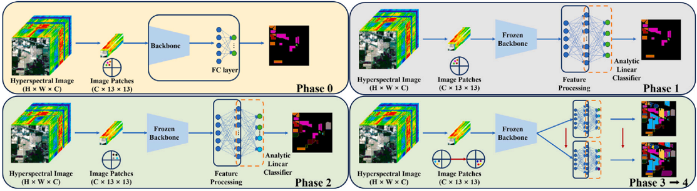</dt>
  <dd><a href="https://www.sciencedirect.com/science/article/pii/S0016003224007063" class="publication-title">Class incremental learning with analytic learning for hyperspectral image classification</a></dd>
  <dd> Huiping Zhuang, Yue Yan, <strong>Run He</strong>, Ziqian Zeng*</dd>
  <dd> Journal of the Franklin Institute (JCR Q1), Volume 361, Issue 18, 2024 </dd>
  <dd><a href="https://www.sciencedirect.com/science/article/pii/S0016003224007063">[Paper]</a> </dd>
</dl>

## Preprint

<dl>
  <dt>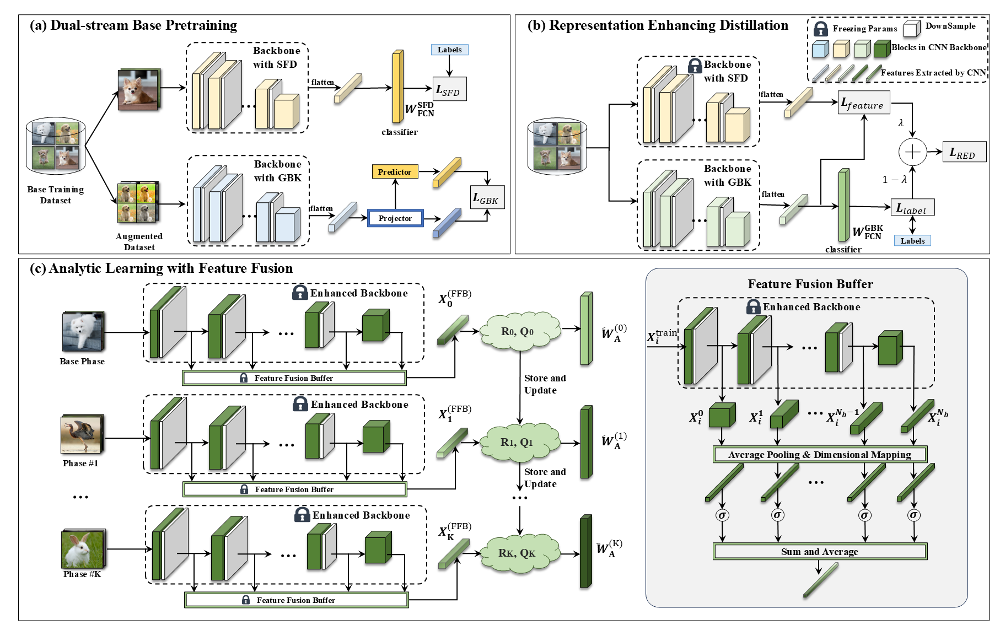</dt>
  <dd><a href="https://arxiv.org/abs/2403.13522" class="publication-title">REAL: Representation Enhanced Analytic Learning for Exemplar-free Class-incremental Learning</a></dd>
  <dd> <strong>Run He</strong>, Di Fang, Yizhu Chen, Kai Tong, Cen Chen, Yi Wang, Lap-pui Chau, Huiping Zhuang*</dd>
  <dd><a href="https://arxiv.org/abs/2403.13522">[ArXiv]</a> </dd>
</dl>

<dl>
  <dt>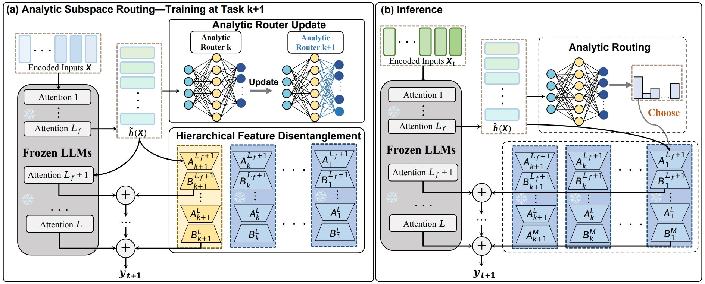</dt>
  <dd><a href="https://arxiv.org/abs/2503.13575" class="publication-title">	
Analytic subspace routing: How recursive least squares works in continual learning of large language model</a></dd>
  <dd> Kai Tong, Kang Pan, Xiao Zhang, Erli Meng, <strong>Run He</strong>, Yawen Cui, Nuoyan Guo, Huiping Zhuang*</dd>
  <dd><a href="https://arxiv.org/abs/2503.13575">[ArXiv]</a> </dd>
</dl>

<!-- # 🎖 Honors and Awards

- *2024.09*: **Nominated Award** for college students' innovative and entrepreneurial works in 2024 China Cyber Security Innovation and Entrepreneurship Competition.
- *2024.08*: **First Prize** in the 17th National College Student Information Security Contest, along with the **Most Innovative and Entrepreneurial Award** (Top 0.1% nation-wide).
- *2024.05*: **First Prize** in the 17th China Undergraduate Computer Design Competition of Middle South Division (Award Rate: 3% division-wide)

# 📖 Educations

- *2021.09 - now*, Undergraduate, [School of Cyber Science and Engineering](https://cse.whu.edu.cn/), [Wuhan University](https://www.whu.edu.cn/), China.
- *2018.09 - 2021.07*, Senior Middle School, [HuBei Wuchang Experimental High School](http://www.ssyzx.net/), China.

# 👏 Miscellaneous

- I am an avid music and band enthusiast. I enjoy exploring various musical styles, with a particular love for shoegaze, city pop, and blues. Music is an integral part of my life that fuels my creativity and inspires my work.
- My girlfriend and I have two adorable cats named Fatbo (肥波) and Summer. They are both funny and have brought a lot of fun to our lives!

  
  
  

 -->

<dl></dl>
